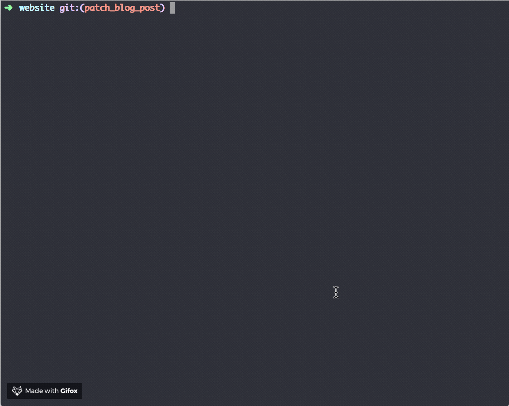
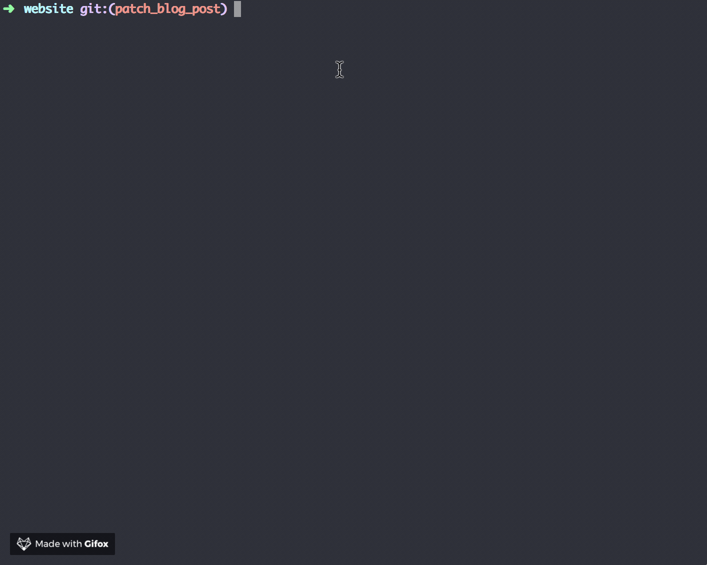

# lint-prepush

[](https://www.npmjs.com/package/lint-prepush)
[](https://www.npmtrends.com/lint-prepush)
[](https://github.com/theenadayalank/lint-prepush/blob/main/LICENSE)

> Run linters on committed files🔬

## Getting Started 🔮

lint-prepush will run linters on the commited files while pushing the code to remote.

### Prerequisites🔭

- This package requires Node.js `>=18.18.0`.
- A package to manage git hooks. (a tool like [Husky](https://github.com/typicode/husky))

### Installing

#### npm

```bash
npm install --save-dev lint-prepush
```

#### using [`yarn`](https://yarnpkg.com/):

```bash
yarn add --dev lint-prepush
```

### Usage

- Configure the following scripts in package.json to lint your committed files 🔧. You can also follow any of the [cosmiconfig](https://github.com/davidtheclark/cosmiconfig) methods to configure lint-prepush.

- pre-push git hook needs to be configured. [Husky](https://github.com/typicode/husky) is a widely used package for managing git hooks.

```diff
{
+ "lint-prepush": {
+   "base": "main",
+    "tasks": {
+      "*.js": [
+        "eslint"
+      ]
+    }
+  }
}
```

The above scrips will lint the js files while pushing to git. It will terminate the process if there are any errors, otherwise, the changes will be pushed.

### Without Errors



### With Errors



### Concurrent Tasks

Tasks for a file group will by default run in linear order (eg. `"*.js": [ "jest", "eslint"]` will run jest first, then after it's done run eslint).
If you'd like to run tasks for a file group concurrently instead (eg. jest and eslint in parallel), use the `concurrent` property like so:

```diff
{
+ "lint-prepush": {
+    "tasks": {
+      "*.js": {
+        concurrent: [ "jest", "eslint" ]
+      }
+    }
+  }
}
```

### Verbose

By default when the tasks succeed, there is no output printed to the console. Sometimes you might need to show linter rules configured for `warn` which should be displayed even if the tasks succeed. In order to achieve this, you can pass the config `verbose: true` so that the task output is printed to the console when the tasks succeed.

```
"lint-prepush": {
  "verbose": true,
  "tasks": {
    ...
  }
}
```

## Built With

- [NodeJs](https://nodejs.org/en/) - Framework used
- [NPM](https://www.npmjs.com/) - Dependency Management
- [VSCode](https://code.visualstudio.com/) - Code Editor

## Contributing

- If you have any ideas, just open an [issue](https://github.com/theenadayalank/lint-prepush/issues) and tell us what you think.
- Pull requests are warmly welcome, If you would like to contribute to this project.

## Versioning

This package use [SemVer](http://semver.org/) for versioning. For the versions available, see the [tags on this repository](https://github.com/theenadayalank/lint-prepush/tags).

## Authors

- **Theena Dayalan** - _Owner_ - [website](https://www.theenadayalan.me/)

See also the list of [contributors](https://github.com/theenadayalank/lint-prepush/contributors) who participated in this project.

## Acknowledgments

- Inspired from [lint-staged](https://github.com/okonet/lint-staged) by [Andrey Okonetchnikov](https://github.com/okonet)

## License

MIT @ [Theena Dayalan](https://www.theenadayalan.me/)
